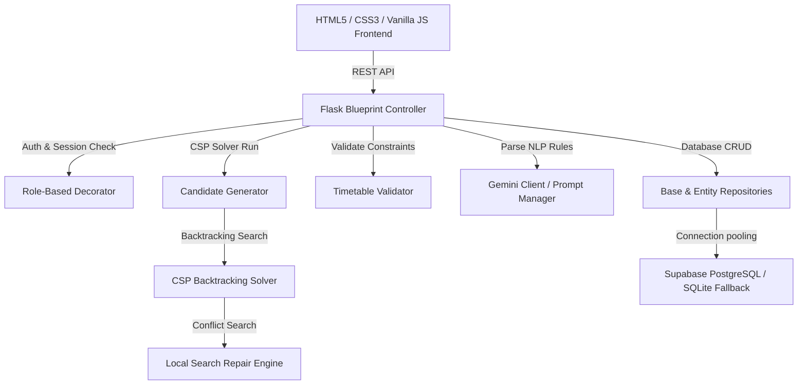

# UniSched — University Timetable Generation ERP System

An AI-powered, conflict-free university schedule generator optimized with backtracking CSP solvers, local search repair, and Google Gemini API rule translation.

---

## 1. Project Overview
UniSched is a professional ERP system designed to automate the process of building weekly university schedules. It supports multi-department setups, shared laboratories, custom faculty preferences, and structured/natural language scheduling constraints.

---

## 2. Features
- **CSP Backtracking Solver**: Generates up to 10 ranked schedule solutions based on soft penalty costs.
- **Local Search Repair Heuristics**: Automatically resolves occupancy conflicts by performing day/period candidate swaps.
- **AI Rule Builder**: Employs Google Gemini 3.5 Flash to translate HOD scheduling rules from natural language into structured parameters.
- **Enterprise-Grade UI Shell**: Single-page authenticated dashboard displaying progress bars, validation diagnosis checklists, custom setting themes (Orange, Blue, Green, Purple, Red), compact density layouts, collapsible navigation sidebars, and searchable help indexes.
- **Multi-Format Exports**: Exports formatted schedules to Print/PDF, styled HTML-based Excel sheets, and CSV tables.


---

## 3. Architecture


---

## 4. Folder Structure
```text
project/
  app/
    core/                   # Domain models and mapper utilities
    repository/             # Connection manager & SQLite/Postgres mappers
    services/               # Local search repair algorithms
    validators/             # MasterValidator and constraint checkers
    exporters/              # Excel, CSV, and HTML print template exporters
    auth/                   # Session verification and login blueprint
    ui/                     # Unified ERP SPA frontend (HTML/CSS/JS)
    api/                    # REST endpoint blueprints and server launcher
    ai/                     # Gemini prompt compiler and client layers
  config/                   # Decoupled environment loader (config.py)
  database/                 # SQLite file and PostgreSQL schema.sql
  docs/                     # SRS specification guidelines
  scripts/                  # Database migration and seeding scripts
  tests/                    # Automated testing suites
    unit/                   # Core unit and integration test modules
```

---

## 5. Installation

### Prerequisites
- Python 3.10+
- SQLite3 or a Supabase account

### Step-by-Step Installation
1. Clone the repository and navigate to the project directory.
2. Initialize and activate your virtual environment:
   ```bash
   python -m venv venv
   source venv/bin/activate  # On Windows: venv\Scripts\activate
   ```
3. Install the dependencies:
   ```bash
   pip install -r requirements.txt
   ```
4. Seed the database (runs on SQLite fallback if no `DATABASE_URL` is set):
   ```bash
   python scripts/migration.py
   python scripts/seed_demo_data.py
   ```

---

## 6. Environment Variables
Copy `.env.example` to `.env` and set up your configurations:
```env
SUPABASE_URL=                # Supabase project REST URL
SUPABASE_KEY=                # Supabase anonymous API key
SUPABASE_SERVICE_ROLE_KEY=   # Supabase service role secret
GEMINI_API_KEY=              # Google Gemini API key
JWT_SECRET=                  # Secret key for token generation
PORT=8000                    # Web server port
```

---

## 7. Running Locally
Start the Flask application server:
```bash
python -m app.api.app
```
Open your browser and navigate to `http://localhost:8000`.

---

## 8. Database & API Integrations

### Supabase Setup
To use Supabase PostgreSQL instead of the default SQLite fallback, specify `DATABASE_URL` in your `.env` file:
```bash
python scripts/migration.py
python scripts/seed_supabase.py
```

### Gemini Setup
Provide a valid `GEMINI_API_KEY` in your `.env` to enable the Gemini 3.5 Flash Rule Builder tab. The natural language input will automatically translate HOD rules into parameter-checked JSON rule objects.

---

## 9. Future Roadmap
- **Drag-and-Drop Editor**: Enable HODs to manually drag periods in the UI and trigger validation checks dynamically.
- **Notification Alerts**: Send automated email/SMS updates to faculty members when their schedules are published.
- **Resource Booking**: Extend section assignments to support projector, projector screen, and auxiliary device reservations.

---
## Build by DIVAKAR M
## 10. License
This project is licensed under the MIT License.
